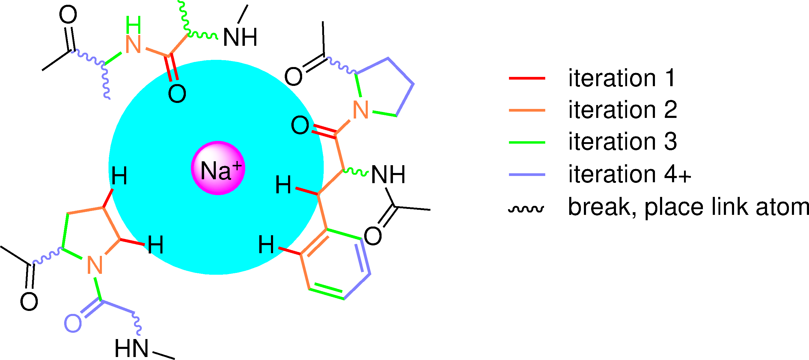

# QM selector - Chemically Sensible Trimmed Structure Generator for QM/MM Calculations

## Overview

QM selector is a Python tool leveraging MDAnalysis to create chemically sensible
trimmed molecular structures centered around a selection of interest. It is designed to
prepare Quantum Mechanics (QM) cluster or QM/MM calculations by selecting
atom subsets and defining link atoms bridging QM and molecular mechanics (MM) regions.

## Features

- Reads molecular structures (e.g. PDB) and associated topologies.
- Defines a core atom selection around user-specified residues or atoms within a configurable radius.
- Merges selections from multiple structures (and topologies if different).
- Performs iterative extension of the selection based on chemical bonding rules.
- Removes small isolated aliphatic fragments optionally.
- Detects and defines link atoms for bonds broken between QM and MM regions.
- Writes selections and link atom definitions in CHARMM-compatible input and PDB formats.

## Extension algorithm: an example
After defining the Na$^+$ ion as centre, the cyan sphere indicates the core atoms
within an initial radius selected. From those, each iteration, following the
connectivity, it is checked if an unlisted atom should be added, to the QM list,
or the bond could be cut and a link atom should be defined.

Currently, cutable bonds are defined in `static.py` for protein atoms and a few
common cases, which can be extended for arbitrary ligands.

## Usage

Run the script from the command line:

```bash
python main.py topology_file structure_file selection_options [OPTIONS]
```

Arguments:

- `topology_file`: Path to the molecular topology file (e.g., PSF).
- `structure_file`: Path to the coordinate structure file (e.g., PDB).
- `selection_options`: Residue or atom selection around which to center the trimmed structure. 
Formatted as `SEGID:RESID` or `SEGID:RESID-ATOM`. Multiple selections can be separated by semicolons.

Optional arguments:

- `-r`, `--radius`: Radius in Angstroms around selection for atom inclusion (default 5.0).
- `-v`, `--verbose`: Enables verbose logging output.
- `--noh`: Ignore hydrogens in initial atom selection.
- `-o`, `--output`: Output file suffix for generated files (default "selection").
- `-l`, `--link`: Method of link atom placement. Options are `charmm` (default) or `geometry`.
- `-c`, `--deleteCH`: Delete small methane and ethane fragments from selection.
- `-ms`, `--multi-structure`: Paths to additional structures to consider in merge.
- `-mt`, `--multi-topology`: Paths to multiple additional topologies corresponding to multi-structures.

Example:

```bash
python main.py system.psf system.pdb PROA:43 -r 6.0 -v --noh -o qm_selection
```

This runs centered on residue 43 in segment PROA, with a 6 Å radius, verbose output,
ignoring hydrogens, and writes output files with suffix "qm_selection".

## Output

- Trimmed structure files in PDB format.
- CHARMM input files defining QM/MM selections and link atoms (if `charmm` link method is used).

## Contributing

Contributions, issues, and feature requests are welcome.

[MIT License](https://opensource.org/license/MIT)